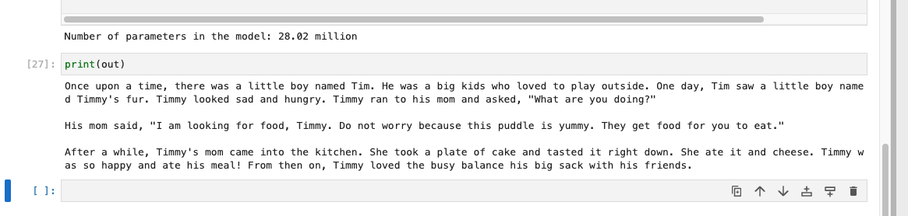

## Story Generation with NanoGPT

In this project, I'm implementing a language model designed to generate stories. The model is trained on TinyStories sourced from Hugging Face, utilizing the nanoGPT architecture. This version of nanoGPT features 2 billion parameters, making it well-suited for story generation tasks.

## Dataset
 Link - https://huggingface.co/datasets/roneneldan/TinyStories
 
 TinyStories is a curated collection of short stories, providing a rich and diverse set of examples for the model to learn from. This dataset contains 2.1 Million short stories.

## Model 
Model: nanoGPT (28.02 Million parameters)

Training Loss: 2.03

Validation Loss: 1.92

## Output Snapshots 

